# Лабораторные работы №4–6: Графы. Дорожная сеть района

**Тема:** Моделирование и анализ дорожной сети района с помощью взвешенного неориентированного графа  
**Дисциплина:** Алгоритмизация и программирование  
**Вариант:** №3  
**Единый проект:** ЛР №4 → ЛР №5 → ЛР №6

---

## Об авторе

- Студент: Воронова А.С.
- Группа: Б.ПИН.ИИ.25.16
- Специальность: Разработка систем искусственного интеллекта (09.03.04)

---

## Описание проекта

Десктопное приложение на Windows Forms (C#), реализующее полный цикл анализа дорожной сети района. Вершины графа — перекрёстки улиц, рёбра — дорожные участки с расстоянием в километрах. Проект разрабатывался поэтапно в трёх лабораторных работах, каждая из которых добавляла новую функциональность.

---

## Функциональные возможности

### ЛР №4 — Построение графа. Алгоритмы обхода

| Функция | Описание |
|---------|----------|
| Загрузка графа | Из `.txt`-файла через диалог, формат `VERTICES` / `EDGES` |
| BFS | Обход в ширину от выбранной вершины, вывод порядка посещения |
| DFS | Обход в глубину (итеративный, через стек) |
| Достижимость | Проверка существования пути между двумя вершинами (BFS) |
| Компоненты связности | Нахождение всех изолированных частей сети |

### ЛР №5 — Взвешенный граф. Алгоритм Дейкстры

| Функция | Описание |
|---------|----------|
| Дейкстра (все расстояния) | Кратчайшие расстояния от источника до всех вершин |
| Дейкстра (маршрут) | Кратчайший путь между двумя вершинами с восстановлением цепочки |

### ЛР №6 — Дополнительный анализ графа

| Функция | Описание |
|---------|----------|
| Точки сочленения | Алгоритм Тарьяна — критические перекрёстки, удаление которых разрывает сеть |
| МОД (алгоритм Прима) | Минимальное остовное дерево — минимальная инфраструктура для связи всех перекрёстков |
| Задача варианта №3 | Кратчайший маршрут между двумя перекрёстками с пошаговой трассировкой |

---

## Технологический стек

| Компонент | Версия |
|-----------|--------|
| Язык | C# 12 |
| Платформа | .NET 8.0 |
| UI | Windows Forms (WinForms) |
| Хранение графа | Список смежности `Dictionary<string, List<(string, double)>>` |
| Тестирование | MSTest 3.3.1 |
| Покрытие кода | coverlet.collector 10.0.0 + ReportGenerator |
| IDE | Visual Studio 2026 |

---

## Структура проекта

```mermaid
flowchart TD
    MAIN["Lab04_Variant03\nосновной проект WinForms"]

    MAIN --> PROGRAM["Program.cs\nточка входа — запуск Form1"]
    MAIN --> DESIGNER["Form1.Designer.cs\nразметка UI — кнопки, списки, поле вывода"]
    MAIN --> FORM1["Form1.cs\nлогика интерфейса"]
    MAIN --> GRAPH["Graph.cs\nалгоритмическое ядро"]
    MAIN --> DATA["graph_data.txt\nданные графа — 15 вершин, 22 ребра"]

    FORM1 --> F1["btnLoad_Click\nзагрузка графа из файла"]
    FORM1 --> F2["btnBfs_Click\nBFS — обход в ширину"]
    FORM1 --> F3["btnDfs_Click\nDFS — обход в глубину"]
    FORM1 --> F4["btnReach_Click\nпроверка достижимости"]
    FORM1 --> F5["btnComponents_Click\nкомпоненты связности"]
    FORM1 --> F6["btnDijkstraAll_Click\nДейкстра — все расстояния"]
    FORM1 --> F7["btnDijkstraPath_Click\nДейкстра — маршрут"]
    FORM1 --> F8["btnArticulation_Click\nточки сочленения"]
    FORM1 --> F9["btnPrimMST_Click\nМОД — алгоритм Прима"]
    FORM1 --> F10["btnVariantTask_Click\nзадача варианта №3"]

    GRAPH --> G1["AddVertex / AddEdge\nGetNeighbors / ContainsVertex"]
    GRAPH --> G2["BFS / DFS\nIsReachable\nGetConnectedComponents"]
    GRAPH --> G3["Dijkstra\nRestorePath"]
    GRAPH --> G4["FindArticulationPoints\nалгоритм Тарьяна — O(V+E)"]
    GRAPH --> G5["PrimMST\nалгоритм Прима — O(V²)"]
    GRAPH --> G6["LoadFromFile\nзагрузка из .txt"]
```



### Методы класса Graph

```
ЛР №4   AddVertex, AddEdge, GetNeighbors, ContainsVertex
        BFS, DFS, IsReachable, GetConnectedComponents
        LoadFromFile

ЛР №5   Dijkstra, RestorePath

ЛР №6   FindArticulationPoints   ← алгоритм Тарьяна, O(V+E)
        PrimMST                  ← алгоритм Прима,   O(V²)
```

---

## Формат файла данных

```
# Комментарий — строка игнорируется

VERTICES
ул.Ленина/ул.Мира
ул.Ленина/пр.Победы
...

EDGES
ул.Ленина/ул.Мира;ул.Ленина/пр.Победы;1.2
ул.Мира/пр.Победы;пр.Победы/ул.Садовая;2.1
...
```

- Вес ребра — расстояние в км, разделитель — точка (`1.75`)
- Используется `InvariantCulture` при парсинге
- Строки с `#` и пустые строки игнорируются

---

## Запуск проекта

### Клонирование

```bash
git clone https://github.com/fisaxili/Lab04_Variant03.git
cd Lab04_Variant03
```

### Запуск приложения

```bash
cd Lab04_Variant03
dotnet run
```

Или открыть `Lab04_Variant03.slnx` в Visual Studio 2026 и нажать **F5**.

### Запуск тестов

```bash
cd Lab04_Variant03.Tests
dotnet test
```

### Покрытие кода

```bash
cd Lab04_Variant03.Tests
dotnet test --collect:"XPlat Code Coverage" --settings coverage.runsettings
reportgenerator -reports:"TestResults/**/coverage.cobertura.xml" -targetdir:"coverage" -reporttypes:Html
start coverage\index.html
```

Покрытие считается только по классу `Graph` — формы исключены через `coverage.runsettings`.

---

**15 вершин** — перекрёстки улиц района  
**22 ребра** — дорожные участки между перекрёстками
