# Лабораторная работа №4: Графы. Обходы и анализ связности

**Тема:** Моделирование дорожной сети района с помощью взвешенного неориентированного графа  
**Дисциплина:** Алгоритмизация и программирование  
**Вариант:** №3

---

## Об авторе

- Студент: Воронова А.С.
- Группа: Б.ПИН.ИИ.25.16
- Специальность: Разработка систем искусственного интеллекта (09.03.04)

---

## Описание проекта

Десктопное приложение на Windows Forms (C#), реализующее анализ дорожной сети района, представленной в виде взвешенного неориентированного графа. Вершины графа — перекрёстки улиц, рёбра — дорожные участки с расстоянием в километрах. Граф загружается из текстового файла заданного формата.

### Основные функциональные возможности

#### **Загрузка графа**
- Загрузка из `.txt`-файла через диалог открытия файла
- Формат файла: секция `VERTICES` (вершины) и секция `EDGES` (рёбра в формате `Вершина1;Вершина2;Вес`)
- Поддержка комментариев (`#`) и пустых строк
- Автоматическое заполнение выпадающих списков после загрузки

#### **Обход в ширину (BFS)**
- Выбор стартовой вершины из списка
- Вывод порядка посещения всех достижимых вершин
- Использует очередь (FIFO), гарантирует обход по уровням

#### **Обход в глубину (DFS)**
- Выбор стартовой вершины из списка
- Итеративная реализация через стек (LIFO)
- Вывод порядка посещения всех достижимых вершин

#### **Проверка достижимости**
- Выбор двух вершин: «из» и «в»
- Определяет, существует ли путь между ними (через BFS)
- Результат выводится с явным указанием достижима / не достижима

#### **Компоненты связности**
- Нахождение всех компонент связности графа
- Вывод состава каждой компоненты с количеством вершин
- Позволяет выявить изолированные участки дорожной сети

---

## Технологический стек

- Язык программирования: C# 12
- Платформа: .NET 8.0
- Тип приложения: Windows Forms (WinForms)
- Хранение графа: список смежности (`Dictionary<string, List<(string, double)>>`)
- Тестирование: MSTest 3.3.1 + coverlet.collector 10.0.0
- Среда разработки: Visual Studio 2026

---

## Структура проекта

```mermaid
flowchart TD
    ROOT["Lab04_Variant03\nосновной проект WinForms"]
    ROOT --> GRAPH["Graph.cs\nядро — структура данных и алгоритмы"]
    ROOT --> FORM1["Form1.cs\nлогика интерфейса"]
    ROOT --> DESIGNER["Form1.Designer.cs\nкод интерфейса (дизайнер)"]
    ROOT --> PROGRAM["Program.cs\nточка входа"]
    ROOT --> DATA["graph_data.txt\nтестовые данные (15 вершин, 22 ребра)"]
    ROOT --> CSPROJ["Lab04_Variant03.csproj\nфайл проекта"]

    GRAPH --> G1["AddVertex(string name)"]
    GRAPH --> G2["AddEdge(string from, string to, double weight)"]
    GRAPH --> G3["BFS(string start)"]
    GRAPH --> G4["DFS(string start)"]
    GRAPH --> G5["IsReachable(string source, string target)"]
    GRAPH --> G6["GetConnectedComponents()"]
    GRAPH --> G7["LoadFromFile(string path)"]

    FORM1 --> F1["btnLoad_Click() — загрузка файла"]
    FORM1 --> F2["btnBfs_Click() — запуск BFS"]
    FORM1 --> F3["btnDfs_Click() — запуск DFS"]
    FORM1 --> F4["btnReach_Click() — проверка достижимости"]
    FORM1 --> F5["btnComponents_Click() — компоненты связности"]

    TESTS["Lab04_Variant03.Tests\nтестовый проект MSTest"]
    TESTS --> T1["GraphTests.cs\n40 тестов"]
    T1 --> T2["AddVertex / AddEdge / ContainsVertex"]
    T1 --> T3["BFS — 5 тестов"]
    T1 --> T4["DFS — 5 тестов"]
    T1 --> T5["IsReachable — 5 тестов"]
    T1 --> T6["GetConnectedComponents — 5 тестов"]
    T1 --> T7["LoadFromFile — 4 теста"]
```



---

## Формат файла данных

```
# Комментарий — строка игнорируется

VERTICES
ул.Ленина/ул.Мира
ул.Ленина/пр.Победы
...

EDGES
ул.Ленина/ул.Мира;ул.Ленина/пр.Победы;1.2
ул.Ленина/ул.Мира;ул.Мира/пр.Победы;0.8
...
```

Вес ребра задаётся в формате с точкой (`1.75`), используется `InvariantCulture`.

---

## Запуск проекта

### Клонирование репозитория

```bash
git clone https://github.com/fisaxili/Lab04_Variant03.git
cd Lab04_Variant03
```

### Запуск приложения

```bash
cd Lab04_Variant03
dotnet run
```

Альтернативный способ — открыть `Lab04_Variant03.slnx` в Visual Studio 2026 и нажать F5.

### Запуск тестов

```bash
cd Lab04_Variant03.Tests
dotnet test
```

### Покрытие кода (Code Coverage)

```bash
cd Lab04_Variant03.Tests
dotnet test --collect:"XPlat Code Coverage" --settings coverage.runsettings
reportgenerator -reports:"TestResults/**/coverage.cobertura.xml" -targetdir:"coverage" -reporttypes:Html
start coverage\index.html
```

Отчёт откроется в браузере. Покрытие считается только по классу `Graph` (формы исключены через `coverage.runsettings`).

---

## Тестирование

Тестовый проект `Lab04_Variant03.Tests` содержит **40 модульных тестов** на базе MSTest, покрывающих все публичные методы класса `Graph`:

| Группа тестов             | Количество |
|---------------------------|-----------|
| AddVertex / AddEdge       | 6         |
| BFS                       | 5         |
| DFS                       | 5         |
| IsReachable               | 5         |
| GetConnectedComponents    | 5         |
| LoadFromFile              | 4         |
| Прочие (GetNeighbors и др.)| 10        |

Все тесты проходят без ошибок: `всего: 40; сбой: 0; успешно: 40`.
